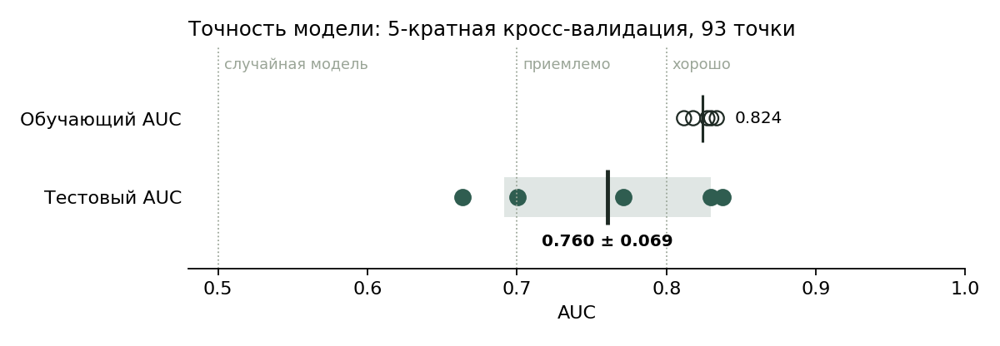
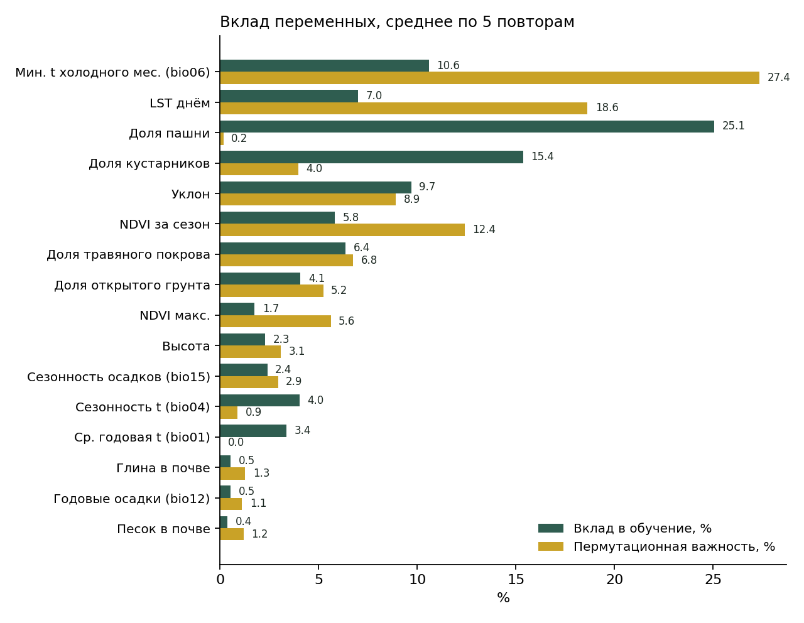
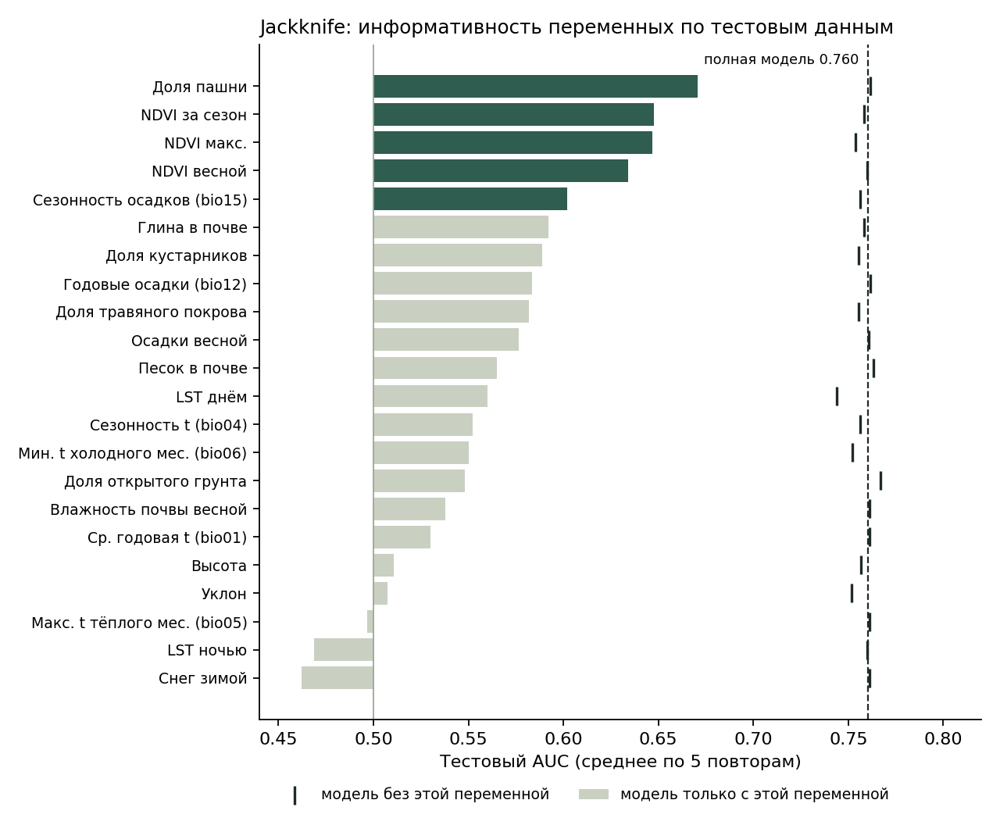

# Пригодность местообитаний саранчовых в Казахстане

Модель экологической ниши саранчовых (Orthoptera: Acrididae) в Казахстане. Модель построена методом MaxEnt по точкам полевого обследования и 22 слоям среды, выгруженным из Google Earth Engine.

**🗺 Веб-карта с результатами:** `https://github.com/AigulBekbayeva/locust_niche_modelling`. На ней показаны карта пригодности, слои среды, исходные точки обследования и точность модели.

| Показатель | Значение |
|---|---|
| Точек находок | 93 (ячейки 1 км) |
| Предикторов | 22 |
| Тестовый AUC | **0.760 ± 0.069** (5-кратная кросс-валидация) |
| Обучающий AUC | 0.824 |
| Главные факторы | минимальная зимняя температура, температура поверхности летом, пашня, кустарники, NDVI |

---

## Задача

Определить, какие условия среды характерны для мест находок саранчовых, и оценить пригодность всей территории Казахстана для этой группы. Моделировалась обобщённая ниша саранчовых без разделения на виды: для отдельных видов данных недостаточно, у большинства меньше 15 точек.

## Данные наблюдений

Использованы материалы полевого обследования саранчовых в 16 областях Казахстана (46.8–80.4° в. д., 41.5–54.9° с. ш.). Всего 580 записей о 85 видах в 109 точках обследования. Для каждой записи указаны вид, численность за час сбора, тип местообитания, растительный состав и агроклиматическая зона.

Все записи объединены в одну группу «саранчовые». Если в одну ячейку сетки 1 км попадало несколько записей, оставлялась одна. В итоге для модели осталось **93 точки находок**.

Самые частые виды выборки: *Calliptamus italicus* (итальянский прус), *Oedaleus decorus*, *Dociostaurus brevicollis*, *Calliptamus barbarus*, *Chorthippus biguttulus*.

## Предикторы среды

Все слои приведены в Google Earth Engine к единой сетке: EPSG:4326, шаг 30″ (≈ 1 км), маска по территории Казахстана. Мелкие данные (30–250 м) осреднены до 1 км, грубые (ERA5-Land, ~11 км) интерполированы билинейно.

| Группа | Переменная | Источник | Период |
|---|---|---|---|
| Климат | `bio01` средняя годовая температура, `bio04` сезонность температуры, `bio05` макс. температура тёплого месяца, `bio06` мин. температура холодного месяца, `bio12` годовые осадки, `bio15` сезонность осадков | WorldClim v1 | климатическая норма |
| Температура поверхности | `lst_day`, `lst_night` — дневная и ночная LST, апрель–сентябрь | MODIS MOD11A2 | 2015–2024 |
| Растительность | `ndvi_spring` (апр–июн), `ndvi_season` (апр–сен), `ndvi_max` | MODIS MOD13A2, только пиксели хорошего качества | 2015–2024 |
| Увлажнение и снег | `prec_spring` осадки апр–июн, `soilm_spring` влажность почвы 0–7 см, `snow_winter` глубина снега дек–фев | ERA5-Land | 2015–2024 |
| Рельеф | `elev` высота, `slope` уклон | SRTM 90 м | — |
| Земной покров | доли травяного покрова `lc_grass`, пашни `lc_crops`, кустарников `lc_shrub`, открытого грунта `lc_bare` | Copernicus Global Land Cover 100 м | 2019 |
| Почва | `soil_sand` песок, `soil_clay` глина, поверхностный слой | OpenLandMap | — |

Весенние переменные взяты по срокам отрождения личинок. Зимние (минимальная температура, снег) — по условиям перезимовки кубышек. Сезонные (LST, NDVI) — по периоду развития и питания. Спутниковый продукт осадков CHIRPS не использовался: он покрывает территорию только до 50° с. ш., а заметная часть точек лежит севернее.

## Моделирование

| Параметр | Значение |
|---|---|
| Программа | MaxEnt 3.4.4 |
| Типы признаков | автоматический выбор (linear, quadratic, product, hinge) |
| Регуляризация | betamultiplier = 2 |
| Проверка | 5-кратная кросс-валидация: в каждом повторе ~74 точки для обучения, ~19 для теста |
| Фон | ~10 000 случайных точек по территории Казахстана |
| Вывод | cloglog (0–1), среднее и стандартное отклонение по 5 повторам |

Все 22 переменные сохранены, в том числе коррелирующие. На прогнозную карту это почти не влияет, но вклад отдельных переменных приходится интерпретировать по группам факторов.

Регуляризация повышена по сравнению со значением по умолчанию (1), чтобы при 93 точках и 22 переменных ограничить переобучение.

## Результаты

### Точность



Средний тестовый AUC равен **0.760 ± 0.069**: модель заметно лучше случайной различает места находок и фон. Для обобщённой модели целой группы видов с разными требованиями к среде это приемлемый результат. Между повторами тестовый AUC меняется от 0.66 до 0.84. Разница между обучающим (0.824) и тестовым AUC небольшая, то есть сильного переобучения нет.

| Порог | Значение cloglog | Доля территории выше порога | Пропуск тестовых точек |
|---|:---:|:---:|:---:|
| 10 % обучающих точек | 0.39 | 41 % | 22 % |
| Макс. чувствительность + специфичность | 0.45 | 34 % | 26 % |

На веб-карте слой «Пригодные территории» построен по первому порогу.

### Вклад переменных



MaxEnt даёт две оценки вклада переменной. Вклад в обучение показывает, насколько переменная улучшала модель в ходе подгонки. Пермутационная важность показывает, насколько падает точность, если значения переменной случайно перемешать. Вторая оценка устойчивее к порядку, в котором модель подбирала переменные.

- **Температурный режим** — главный фактор по пермутационной важности. Минимальная температура холодного месяца (`bio06`, 27.4 %) связана с условиями перезимовки кубышек. Дневная температура поверхности в сезон (`lst_day`, 18.6 %) — с условиями развития личинок и имаго. Без `lst_day` тестовый AUC падает сильнее всего (с 0.760 до 0.744): эту информацию не дублирует ни одна другая переменная.
- **Земной покров.** Доля пашни дала наибольший вклад в обучение (25.1 %), и модель только с этой переменной — лучшая из одиночных (AUC 0.67). При этом её пермутационная важность почти нулевая (0.2 %). Значит, та же информация содержится в других слоях, прежде всего в NDVI, и полная модель без пашни не теряет в точности. Доля кустарников (15.4 %) и травяного покрова (6.4 %) дополняют описание структуры местообитаний.
- **Растительность.** Сезонный NDVI (пермутационная важность 12.4 %) и максимальный NDVI (5.6 %) описывают продуктивность растительного покрова, то есть кормовую базу. По отдельности NDVI-переменные дают AUC 0.63–0.65.
- **Рельеф.** Уклон (9.7 / 8.9 %) — единственная рельефная переменная с заметным вкладом.
- Годовые и весенние осадки, влажность почвы, снег и ночная LST почти не участвуют в модели.

Форма зависимости пригодности от каждого фактора показана на кривых отклика в отчёте MaxEnt.

### Jackknife



Исключение любой одной переменной почти не меняет точность модели: без каждой из них тестовый AUC остаётся в пределах 0.744–0.767. Информация в наборе предикторов сильно дублируется. Поэтому выводы о значимости стоит делать по группам (температура, покров, растительность), а не по отдельным слоям.

### Карта пригодности

Карта средней пригодности, карта неопределённости (SD между повторами) и бинарная карта пригодных территорий доступны на веб-карте. Там же можно включить любой из 22 слоёв среды и посмотреть исходные точки с перечнем видов и численностью.

## Дополнительно: модели растительных сообществ

По той же схеме построены модели для двух растительных сообществ, которые встречались минимум в 15 ячейках:

- разнотравной степи (*Achillea nobilis, Potentilla* spp., *Galium verum, Centaurea* spp.) — тестовый AUC 0.646;
- полынно-злаковой степи (*Artemisia* spp., *Stipa* spp., *Festuca valesiaca, Koeleria cristata*) — тестовый AUC 0.705.

Обе модели слабее модели саранчовых из-за малого числа точек (25 и 18). Полные результаты — в `results/communities/`.

## Ограничения

- **Обобщённая ниша.** Модель объединяет 85 видов с разными требованиями, от пустынных до луговых. Она показывает условия, благоприятные для саранчовых в целом, и не заменяет видовые модели, например для итальянского пруса.
- **Неравномерность обследования.** Точки сосредоточены вдоль маршрутов экспедиций, восток страны (восточнее 80° в. д.) не обследован. Прогноз для этих районов — экстраполяция.
- **Случайная кросс-валидация.** Тестовые точки могут лежать близко к обучающим, поэтому AUC, вероятно, несколько завышен. Более строгая оценка — пространственная блочная кросс-валидация.
- **Коррелирующие предикторы.** Вклад отдельных переменных условен.
- **Разновременность данных.** Климатическая норма WorldClim, спутниковые ряды 2015–2024 гг. и карта покрова 2019 г. относятся к разным периодам.
- **Присутствие без отсутствия.** MaxEnt использует только находки. Отсутствие вида в обследованной точке не учитывалось, хотя такие данные в обследовании есть.

## Состав репозитория

```
├── README.md                  описание работы
├── docs/                      веб-карта (GitHub Pages)
│   ├── index.html, app.js, style.css
│   ├── data/                  точность модели, вклад переменных, точки обследования, описание слоёв
│   └── layers/                растры результатов и 22 слоя среды (PNG, Web Mercator)
├── figures/                   графики для README
├── results/
│   ├── locusts/               maxentResults.csv — модель саранчовых
│   └── communities/           maxentResults.csv — модели растительных сообществ
└── scripts/                   выгрузка из Google Earth Engine, подготовка данных, веб-карта, графики
```

## Литература

- Phillips S. J., Anderson R. P., Schapire R. E. (2006). Maximum entropy modeling of species geographic distributions. *Ecological Modelling*, 190, 231–259.
- Phillips S. J., Anderson R. P., Dudík M., Schapire R. E., Blair M. E. (2017). Opening the black box: an open-source release of Maxent. *Ecography*, 40, 887–893.
- Hijmans R. J., Cameron S. E., Parra J. L., Jones P. G., Jarvis A. (2005). Very high resolution interpolated climate surfaces for global land areas. *International Journal of Climatology*, 25, 1965–1978.
- Muñoz-Sabater J. et al. (2021). ERA5-Land: a state-of-the-art global reanalysis dataset for land applications. *Earth System Science Data*, 13, 4349–4383.
- Buchhorn M. et al. (2020). Copernicus Global Land Service: Land Cover 100m, collection 3. Zenodo.
- Gorelick N. et al. (2017). Google Earth Engine: planetary-scale geospatial analysis for everyone. *Remote Sensing of Environment*, 202, 18–27.
